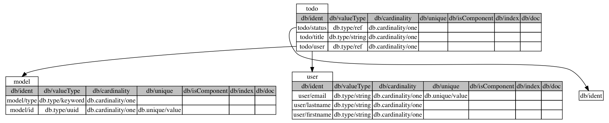
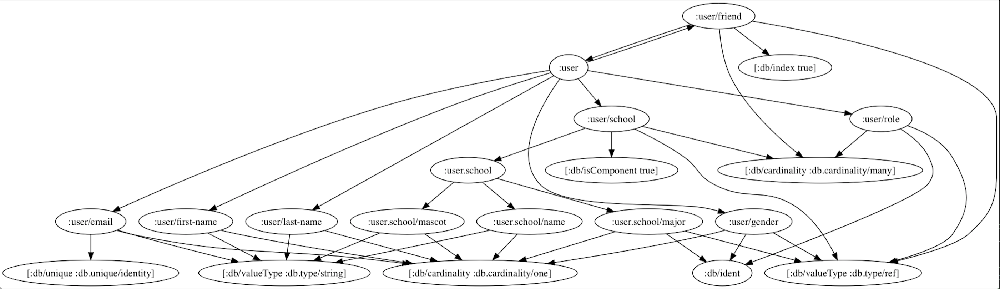

# datomap

A Clojure library containing schema utilities and visualization tools.

### Note!
Datomap only works if the schema is populated with data. Because datomic
schema is defined as attribute definitions with references being dynamic with
with regard to what they reference, it is impossible to visualize
relations without those relations being present.


## Usage

Mostly useful from the repl for dealing with the Datomic schema of
an application. Datomp provides two different visualization modes
(tables or nodes), the ability to write the "tables" graph to a file,
and the ability to "dump" a schema to a transactable edn map or write
the schema to a file.

### Schema Utils

```clojure
user> (require '[datomic.api :as d])
nil
user> (require '[datomap.core :as dmap])
nil
user> (require '[datomap.io :as dmap.io])
nil
user> (def dbval (d/db (:conn (:db system))))
#'user/dbval

;; Dump schema to REPL

user> (def schema (dmap.core/schema->txable dbval))
#'user/schema
user> (pprint schema)
[{:db/id {:part :db.part/db, :idx -71},
  :db/ident :user/email,
  :db/valueType :db.type/string,
  :db/cardinality :db.cardinality/one,
  :db/unique :db.unique/identity}
 {:db/id {:part :db.part/db, :idx -73},
  :db/ident :user/friend,
  :db/valueType :db.type/ref,
  :db/cardinality :db.cardinality/many,
  :db/index true}
 {:db/id {:part :db.part/db, :idx -69},
  :db/ident :user/last-name,
  :db/valueType :db.type/string,
  :db/cardinality :db.cardinality/one}
 {:db/id {:part :db.part/db, :idx -74},
  :db/ident :user/school,
  :db/valueType :db.type/ref,
  :db/cardinality :db.cardinality/many,
  :db/isComponent true}
 {:db/id {:part :db.part/db, :idx -72},
  :db/ident :user/role,
  :db/valueType :db.type/ref,
  :db/cardinality :db.cardinality/many}
 {:db/id {:part :db.part/db, :idx -70},
  :db/ident :user/gender,
  :db/valueType :db.type/ref,
  :db/cardinality :db.cardinality/one}
 {:db/id {:part :db.part/db, :idx -68},
  :db/ident :user/first-name,
  :db/valueType :db.type/string,
  :db/cardinality :db.cardinality/one}
 {:db/id {:part :db.part/db, :idx -80},
  :db/ident :user.school/major,
  :db/valueType :db.type/ref,
  :db/cardinality :db.cardinality/one}
 {:db/id {:part :db.part/db, :idx -75},
  :db/ident :user.school/name,
  :db/valueType :db.type/string,
  :db/cardinality :db.cardinality/one}
 {:db/id {:part :db.part/db, :idx -81},
  :db/ident :user.school/mascot,
  :db/valueType :db.type/string,
  :db/cardinality :db.cardinality/one}]
nil

;; Grab schema related to a particular entity namespace or root, e.g. :user from
;; the example loaded in dev/user.clj

user> (def schema-by-root (dmap/dump-schema db))
#'user/schema-by-root
user> (pprint schema-by-root)
{:user
 [{:db/id 71,
   :db/ident :user/email,
   :db/valueType :db.type/string,
   :db/cardinality :db.cardinality/one,
   :db/unique :db.unique/identity}
  {:db/id 73,
   :db/ident :user/friend,
   :db/valueType :db.type/ref,
   :db/cardinality :db.cardinality/many,
   :db/index true}
  {:db/id 69,
   :db/ident :user/last-name,
   :db/valueType :db.type/string,
   :db/cardinality :db.cardinality/one}
  {:db/id 74,
   :db/ident :user/school,
   :db/valueType :db.type/ref,
   :db/cardinality :db.cardinality/many,
   :db/isComponent true}
  {:db/id 72,
   :db/ident :user/role,
   :db/valueType :db.type/ref,
   :db/cardinality :db.cardinality/many}
  {:db/id 70,
   :db/ident :user/gender,
   :db/valueType :db.type/ref,
   :db/cardinality :db.cardinality/one}
  {:db/id 68,
   :db/ident :user/first-name,
   :db/valueType :db.type/string,
   :db/cardinality :db.cardinality/one}],
 :user.school
 [{:db/id 80,
   :db/ident :user.school/major,
   :db/valueType :db.type/ref,
   :db/cardinality :db.cardinality/one}
  {:db/id 75,
   :db/ident :user.school/name,
   :db/valueType :db.type/string,
   :db/cardinality :db.cardinality/one}
  {:db/id 81,
   :db/ident :user.school/mascot,
   :db/valueType :db.type/string,
   :db/cardinality :db.cardinality/one}]}
nil

;; Turn user schema into something transactable

user> (->> schema-by-root :user (mapv dmap/entity->txable))
[{:db/id #db/id[:db.part/db -71], :db/ident :user/email, :db/valueType :db.type/string, :db/cardinality :db.cardinality/one, :db/unique :db.unique/identity} {:db/id #db/id[:db.part/db -73], :db/ident :user/friend, :db/valueType :db.type/ref, :db/cardinality :db.cardinality/many, :db/index true} {:db/id #db/id[:db.part/db -69], :db/ident :user/last-name, :db/valueType :db.type/string, :db/cardinality :db.cardinality/one} {:db/id #db/id[:db.part/db -74], :db/ident :user/school, :db/valueType :db.type/ref, :db/cardinality :db.cardinality/many, :db/isComponent true} {:db/id #db/id[:db.part/db -72], :db/ident :user/role, :db/valueType :db.type/ref, :db/cardinality :db.cardinality/many} {:db/id #db/id[:db.part/db -70], :db/ident :user/gender, :db/valueType :db.type/ref, :db/cardinality :db.cardinality/one} {:db/id #db/id[:db.part/db -68], :db/ident :user/first-name, :db/valueType :db.type/string, :db/cardinality :db.cardinality/one}]
user>

```

### Visualizing Schema

Assumes the same `require`s and `def`s as above examples

```clojure
;; Render Tables

user> (dmap.io/show-schema-tables! dbval)
#object[javax.swing.JFrame 0x7befb1ac "javax.swing.JFrame[frame0,0,23,640x480,invalid,layout=java.awt.BorderLayout,title=Dorothy (1569x573),resizable,normal,defaultCloseOperation=HIDE_ON_CLOSE,rootPane=javax.swing.JRootPane[,0,22,640x458,invalid,layout=javax.swing.JRootPane$RootLayout,alignmentX=0.0,alignmentY=0.0,border=,flags=16777673,maximumSize=,minimumSize=,preferredSize=],rootPaneCheckingEnabled=true]"]
user>
```



```clojure
;; Represented as graph nodes

user> (dmap.io/show-schema-nodes! dbval)
nil
user>
```



## License

Copyright © 2017 FIXME

Distributed under the Eclipse Public License either version 1.0 or (at
your option) any later version.
